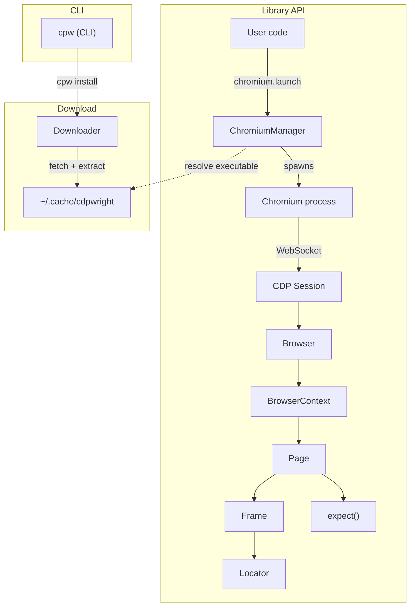

# cdpwright

[](https://github.com/toolstackhq/cdpwright/actions/workflows/ci.yml)
[](https://github.com/toolstackhq/cdpwright/actions/workflows/ci.yml)
[](https://github.com/toolstackhq/cdpwright/actions/workflows/chromium-revision.yml)
[](https://www.npmjs.com/package/@toolstackhq/cdpwright)
[](https://github.com/toolstackhq/cdpwright/blob/main/LICENSE)

Chromium-only automation built on the Chrome DevTools Protocol (CDP). A lightweight, Playwright-style API with `Browser`, `Context`, `Page`, `Frame`, and `Locator` primitives—no test runner included.

Published package size: about 708 KB unpacked on npm, so the library footprint stays small even though Chromium itself is installed separately.

## Quick start

```bash
mkdir my-project && cd my-project
npm init -y
npm install @toolstackhq/cdpwright
npx cpw install     # downloads a pinned Chromium build once
```

Create `quick.mjs` (the `.mjs` extension enables ES modules — no config needed):

```js
// quick.mjs
import { chromium, expect } from "@toolstackhq/cdpwright";

const browser = await chromium.launch({ headless: true });
const page = await browser.newPage();

await page.goto("https://example.com");
await expect(page).element("h1").toHaveText(/Example Domain/);

await browser.close();
```

Run it:
```bash
node quick.mjs
```

If you want Playwright-style lifecycle management outside a test runner, use `chromium.withBrowser()` and skip the manual close:

```js
import { chromium } from "@toolstackhq/cdpwright";

await chromium.withBrowser({ headless: false, logEvents: true }, async (browser) => {
  const page = await browser.newPage();
  await page.goto("https://toolstackhq.github.io/bluledger/login", { waitUntil: "load" });
  await page.type("#customerId", "92718463");
  await page.typeSecure("#password", "Harbour!92");
  await page.click("#login-submit-button");
  await page.expect("#dashboard-transfer-money-link").toBeVisible();
});
```

If you want to scaffold a test suite after `npm init -y`, run:

```bash
npx cpw init test vitest
npx cpw init test mocha
npx cpw init test node
```

That writes a sample test file and updates `package.json` with an `npm test` script for the chosen runner.

Vitest templates import the package's own assertion helper, so generated tests can use `cdpExpect(page).element(...)`. Mocha and `node:test` templates use built-in `assert`.

All scaffolded templates also include the Linux Chromium launch flags used by the repo's CI tests:

```js
args: process.platform === "linux" ? ["--no-sandbox", "--no-zygote", "--disable-dev-shm-usage"] : []
```

> **Tip:** If you prefer `.js` files, add `"type": "module"` to your `package.json`.
> For TypeScript, just rename to `quick.ts` and run with `tsx quick.ts` or `npx ts-node --esm quick.ts`.

## Core ideas
- CDP-only: no WebDriver, no playwright-core dependency.
- Small surface: pages/frames/locators, plus built-in expect matchers.
- Selector routing: CSS by default; XPath if the selector starts with `/`, `./`, `.//`, `..`, or `(/`. Shadow DOM via `>>>` (e.g., `host >>> button`).
- Contexts: `browser.newContext()` gives incognito-style isolation without launching a new browser.
- Helper: `chromium.withBrowser()` launches Chromium, runs your callback, and closes the browser automatically.
- Scaffold: `cpw init test <runner>` writes a starter test file, a local HTML fixture, and an `npm test` script for Vitest, Mocha, or Node's built-in runner.
- Scaffold templates are verified in CI for all supported runners.
- Markdown export: `cpw markdown <url>` converts rendered pages into lightweight Markdown for AI workflows and note-taking.
- Browser install: `npx cpw install` (or `--latest`) fetches Chromium into a local cache once, Playwright-style.

## Key APIs
- `chromium.launch(options)` → `Browser`
- `browser.newContext()` → isolated `BrowserContext`
- `browser.newPage()` / `context.newPage()` → `Page`
- `page.goto(url, { waitUntil: "load" | "domcontentloaded" })`
- Actions: `click`, `dblclick`, `type`, `typeSecure`, `fillInput`, `selectOption`, `setFileInput`
- Queries: `query`, `queryAll`, `queryXPath`, `queryAllXPath`, `locator`
- Assertions: `expect(page).element("selector").toBeVisible()` (see `docs/guide/assertions.md`)

## Architecture



## Docs
Full guide and API reference: https://toolstackhq.github.io/cdpwright/ (built from `docs/` via VitePress). Start at `docs/guide/intro.md` or `docs/guide/api/`.

## Demo app
`index.html` is a local, data-driven visa-style wizard used to stress-test automation flows (no server required). Open it directly via `file://` to exercise navigation, conditionals, overlays, Shadow DOM, uploads, and receipts.

## License
MIT
